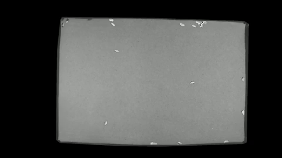
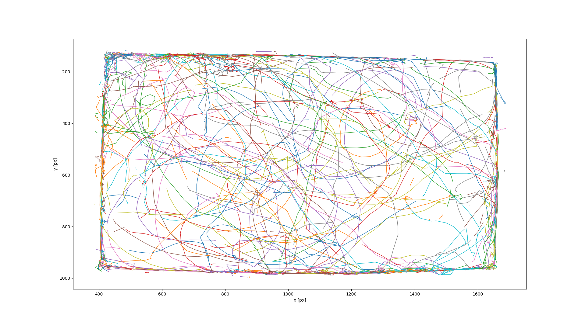

# iso-track

<!-- START doctoc generated TOC please keep comment here to allow auto update -->
<!-- DON'T EDIT THIS SECTION, INSTEAD RE-RUN doctoc TO UPDATE -->

- [introduction](#introduction)
- [installation](#installation)
- [running the script...](#running-the-script)

<!-- END doctoc generated TOC please keep comment here to allow auto update -->

---

## introduction

**iso-track** (**iso**pod-**track**ing) is a semi-automated script to quantify movement of animals in videos. It has been used with the with the freshwater isopod *Asellus aquaticus* (for the scientific background refer to http://luerig.net/Research/#Isopods). The idea is based on [approbatory/motion-tracker](https://github.com/approbatory/motion-tracker) and was implemented with [soft-matter/trackpy](https://github.com/soft-matter/trackpy). Arena selector is based on Dan Masek's answer to [this question](https://stackoverflow.com/questions/37099262/drawing-filled-polygon-using-mouse-events-in-open-cv-using-python)

**Please feel free to get in touch with me if you need help running the script or have questions about customizing it for your own study-system/organism: [contact @ eawag](http://www.eawag.ch/en/aboutus/portrait/organisation/staff/profile/moritz-luerig/show/)**


 


---

## installation

**required software:**

- python (3.6)
- opencv (3.3.1) + dependencies (more info here: https://stackoverflow.com/questions/23119413/how-do-i-install-python-opencv-through-conda)
- trackpy (more info here http://soft-matter.github.io/trackpy/v0.3.0/installation.html)

install, for example, with anaconda (https://www.anaconda.com/download/):

```
conda update conda
conda install numpy pandas 
conda install -c conda-forge opencv 
conda install -c soft-matter trackpy
```

IMPORTANT: The script is not standalone, so a python interpreter needs to be used to modify and execute the script (e.g. [Spyder](https://github.com/spyder-ide/spyder)). Directories and input data need to be specified beforehand inside the script. At some point in the future I may provide a standalone executable version of the program.

---

## running the script...
... one code cell/lense at a time (cells are denoted by "#%%" and create a horizontal line in most IDEs)

1. load iso-track.py script
2. configure your directories 
3. video and detection settings. `blur_kern`, `blur_thresh` and `backgr_thresh` will have the greatest effect on your results. `skip` frames if your organisms are moving too slow, and use `min_area` to exclude more noise. use `dilate_kern` for finetuning. you can (and should) come back here often to improve your results
4. import video_utils script (just a collection of custom functions we need to draw the arena)
5. draw arena. running this section will open a window, where you can select the arena to be included by left clicking. right click will complete the polygon and show you the result (green is included, red excluded in the motion analysis). 
6. open the video file. reads frame by frame (or every nth frame, if you chose to skip frames at 2.). shows you the live process (everything detected as moving gets white overlay) and saves the detected movements to a pandas dataframe. video of overlays is saved as well
7. calculates the trajectories. here you need to find out what works for your case - see [trackpy reference ](http://soft-matter.github.io/trackpy/v0.3.0/generated/trackpy.link_df.html). e.g. the larger the `search_range` or `memory` is, the more challenging it is for the algorithm to find a solution, especially if you have many moving objects in your video. if you have only one, it should be ok to go to high values. the filtering step is optional, but can be useful to eliminate spurious trajectories
